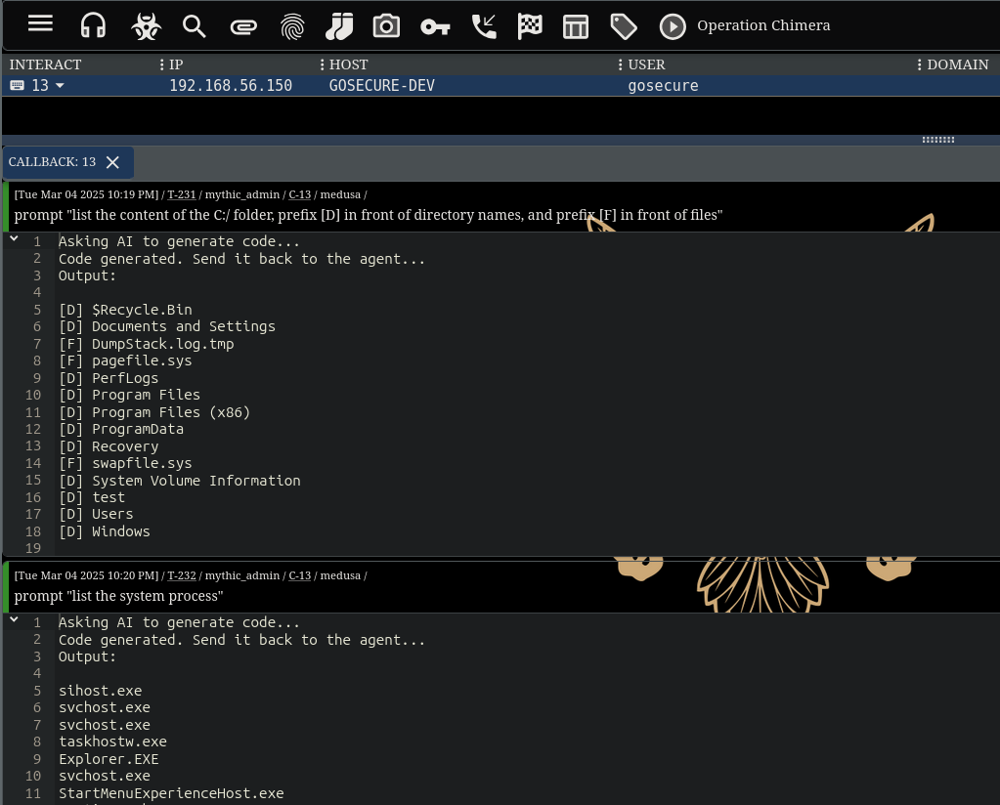

Prompt
------
### Description
This repository contains the following folders:
- **pocs**: Python and C# programs that request and reflectively execute AI-generated code.
- **mythic**: `prompt` command for the Mythic's Medusa agent, which uses a similar principle to the PoC, with some improvements. 

Each folder has its own `README.md` for instructions.

### Project tree overview
```
├── mythic
│   ├── ...
│   └── README.md
├── pocs
│   ├── c#
│   │   ├── ...
│   │   ├── Program.cs 
│   │   └── README.md
│   └── python
│       ├── prompt.py
│       └── README.md
├── images
│   ├── ...
└── README.md
```

### Screenshot
Here's an example of how the `prompt` command is used in the Mythic Medusa's agent:



### Article
Article about this project: [TODO URL] 

