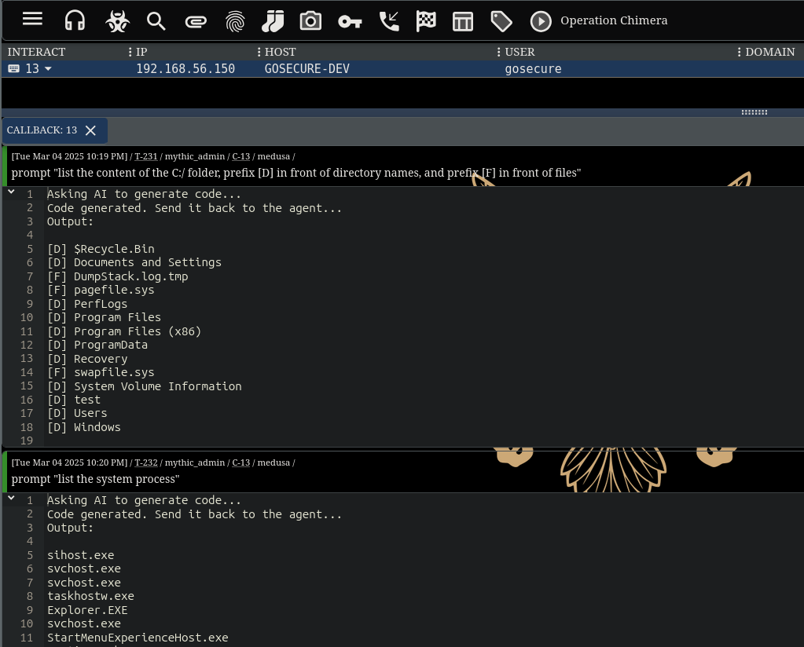

### Description
`prompt` command for the Mythic's Medusa agent.

This command allows an operator to dynamically execute AI-generated code based on prompts (orders).

The following diagram summarize the concept:
```
                            ┌───────────────┐                                  
                            │               │                                  
                            │      AI       │                                  
                            │ API Endpoint  │                                  
                            │               │ 3. Generate code                 
                            └──▲────────┬───┘    and send back                 
                               │        │        to C2
            2. Ask to generate │        │                                      
               code based on   │        │                                      
               prompt          │        │                                      
┌────────┐                    ┌┴────────▼─┐    4. Get jobs      ┌─────────────┐
│        │                    │           │◄────────────────────┤             │
│  User  ├───────────────────►│    C2     │                     │   Implant   │
│        │  1. Issue prompt   │           ├────────────────────►│             │
└────────┘     command        └───────────┘                     └─────────────┘
                                      5. Send                6. Receive code   
                                         generated code         and execute it 
                                                                reflectively   
```

### Installation
1. Install Mythic C2: https://docs.mythic-c2.net/installation
2. Install the HTTP profile: `[Mythic folder]/mythic-cli install github https://github.com/MythicC2Profiles/http`
3. Install the medusa agent: `[Mythic folder]/mythic-cli install github https://github.com/MythicAgents/Medusa`
4. Set your OpenAI API key in the `api_key` variable in the `agent_functions/prompt.py` file
5. Copy the following files in the Mythic server:
    - `agent_code/prompt.py` -> `[Mythic folder]/InstalledServices/medusa/medusa/agent_code/prompt.py`
    - `agent_functions/prompt.py` -> `[Mythic folder]/InstalledServices/medusa/medusa/mythic/agent_functions/prompt.py`
6. Restart the `medusa` container: `[Mythic folder]/mythic-cli restart medusa`

### Usage
1. Execute a medusa agent on a Windows/Linux/MacOS system
2. Load the prompt command inside your agent: `load prompt`
3. Use the prompt command: `prompt` (it will pop the option box)

### Example output
 

